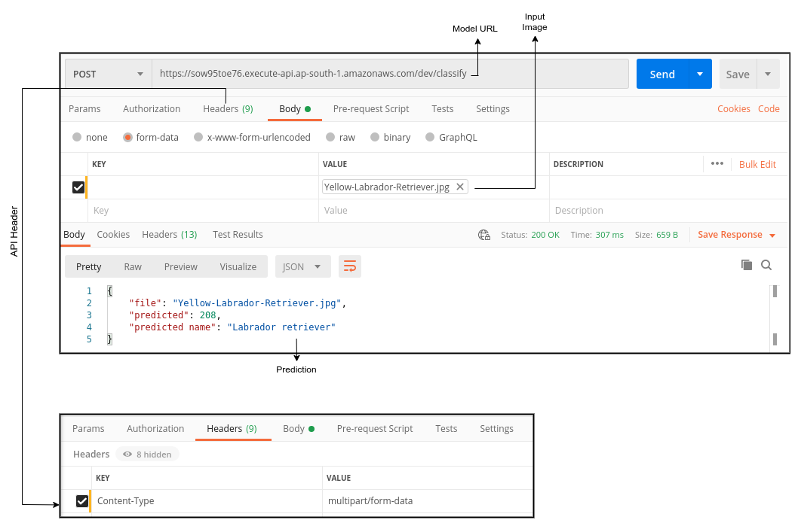

# Session 1 - Deploying over AWS

The goal of this assignment is to deploy a pre-trained MobileNet V2 model over AWS Lambda.

## Results

The deployed model gave the following results  


Image used to test the model:  


_Note:_ It might happen that during the first call the API might give a timed out error. If such error happens, call the API again.

## Testing on Custom Image

API Link: [https://sow95toe76.execute-api.ap-south-1.amazonaws.com/dev/classify](https://sow95toe76.execute-api.ap-south-1.amazonaws.com/dev/classify)

Send a POST request to the link above with the image that needs to be classified.

## Setting Up the Project

### Docker

1. Download the following files from [here](https://download.docker.com/linux/ubuntu/dists/bionic/pool/stable/amd64/).

- `docker-ce_19.03.9~3-0~ubuntu-bionic_amd64.deb`
- `docker-ce-cli_19.03.9~3-0~ubuntu-bionic_amd64.deb`
- `containerd.io_1.2.13-2_amd64.deb`

1. Install Docker

```[bash]
$ sudo dpkg -i docker-ce_19.03.9~3-0~ubuntu-bionic_amd64.deb
$ sudo dpkg -i docker-ce-cli_19.03.9~3-0~ubuntu-bionic_amd64.deb
$ sudo dpkg -i containerd.io_1.2.13-2_amd64.deb
```

1. Setup Docker to start on boot  
   `$ sudo systemctl enable docker`
1. Verify installation with the command  
   `$ sudo docker run hello-world`

### Node.js

1. Setup Node.js

- Install curl  
  `$ sudo apt install curl`
- Install node.js
  ```[bash]
  $ curl -sL https://deb.nodesource.com/setup_10.x -o nodesource_setup.sh
  $ sudo bash nodesource_setup.sh
  $ sudo apt-get install -y nodejs
  ```

1. Install Serverless framework

- Use this command  
  `$ sudo npm install -g serverless`

### Download Pretrained MobilenetV2

```[python]
import torch

model = torch.hub.load('pytorch/vision:v0.6.0', 'mobilenet_v2', pretrained=True)
model.eval()

traced_model = torch.jit.trace(model, trorch.randn(1,3,224,224))
traced_model.save('mobilenetV2.pt')
```

### Serverless

1. Create a virtual environment
1. Create an IAM user in AWS and obtain its **Access key** and **Secret key**.
1. Install a serverless plugin  
   `$ serverless plugin install -n serverless-python-requirements`
1. Configure serverless  
   `$ serverless config credentials --provider aws --key <access_key> --secret <secret_key>`
1. Create a S3 bucket on AWS with the same name assigned to **S3_BUCKET** in `serverless.yml` and upload the downloaded pretrained model in the bucket.

### Deploy on AWS Lambda

- Run the command to deploy the model  
  `$ npm run deploy`
- Enable API to accept binary data
  - Go to _Amazon API Gateway_
  - Select your API
  - Go to settings
  - Add the following Binary Media Types
    ```
    multipart/form-data
    */*
    ```

Your code is deployed on AWS!
