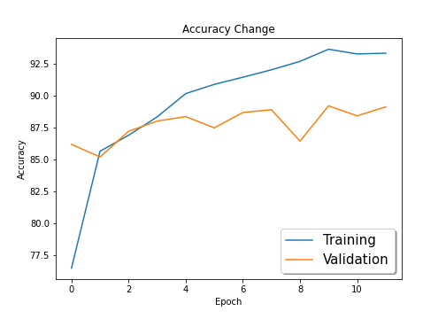
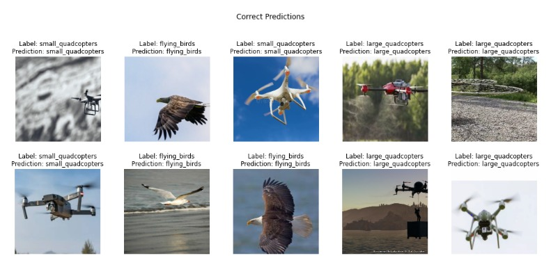
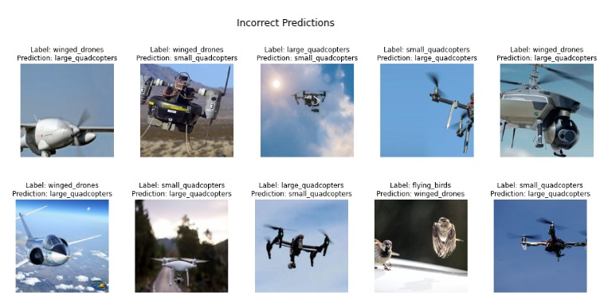
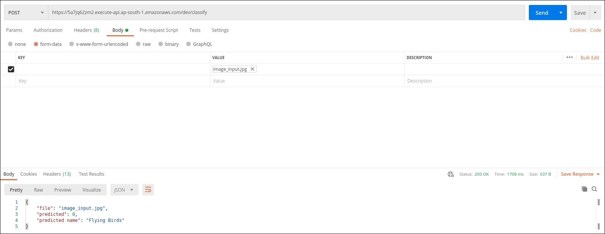
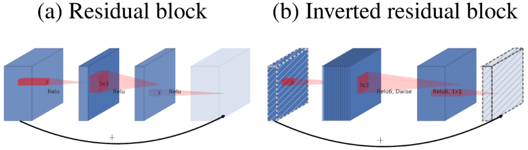

# Session 2 - MobileNets and ShuffleNets

[](https://colab.research.google.com/drive/1MnZKMhE4fLNth7WJ2iZakXgUF1uABrt3?usp=sharing)

The goal of this assignment is to train MobileNet V2 on a custom dataset that conatins the classes small quadcopters, large quadcopters, flying birds and winged drones using transfer learning. After training, the trained model has to be deployed to AWS Lambda.

The model reaches a test accuracy of **89.20%** and was trained for **12 Epochs**.

API Link: [https://5a7jq62zm2.execute-api.ap-south-1.amazonaws.com/dev/classify](https://5a7jq62zm2.execute-api.ap-south-1.amazonaws.com/dev/classify)

## Parameters and Hyperparameters

- Loss Function: Cross Entropy Loss (combination of `nn.LogSoftmax` and `nn.NLLLoss`)
- Optimizer: SGD
- Learning Rate: 0.01
- Data Augmentation
  - Random Resize Crop
- Reduce LR on Plateau
  - Decay factor: 0.1
  - Patience: 2
  - Min LR: 1e-6
- Batch Size: 256
- Epochs: 12

## Results

The model achieves the highest validation accuracy of **89.20%**

### Accuracy Change vs Number of Epochs



### Predictions

#### Correctly Classified Images



#### Misclassified Images



### Deployment

The deployed model gave the following results  


Image used to test the model:  


_Note:_ It might happen that during the first call the API might give a timed out error. If such error happens, call the API again.

## Testing on Custom Image

API Link: [https://5a7jq62zm2.execute-api.ap-south-1.amazonaws.com/dev/classify](https://5a7jq62zm2.execute-api.ap-south-1.amazonaws.com/dev/classify)

Send a POST request to the link above with the image that needs to be classified.

## Dataset

The dataset contains images of the below classes:

Original dataset count:

- flying_birds - 8338
- large_quadcopters - 4169
- small_quadcopters - 3623
- winged_drones - 5675

### Cleaning the Dataset

The dataset initially had a many irrelevant images, that is why data cleaning was done. Following techniques were applied:

- Remove all the image that were not in .jpeg, .jpg and .png format
- Convert .png to .jpeg
- Convert images that had channel 1 or 4 to 3 channel image (RGB)
- Removed all the image that had resolution below than 150x150 (In our experiments, we found that image with resolution below 150x150 were getting distorted upon resizing to 224x224)

Cleaned dataset count:

- flying_birds - 8115
- large_quadcopters - 4097
- small_quadcopters - 3137
- winged_drones - 5540

### Resizing Strategy: RandomResizedCrop

```[python]
transforms.RandomResizedCrop(224)
```

Crop the given image to random scale and aspect ratio. This is popularly used to train the Inception networks.

This will extract a patch of size (224, 224) from input image randomly. So, it might pick this path from topleft, bottomright or anywhere in between.

1. **Utilizing entire 224x224 (each pixel)** to represent input image unlike other techqniues e.g. center aligned on mask which add black border/padding.
2. In this part, we are also doing **data augmentation** to increase the variability of the input images, as a result, model has higher robustness to the images obtained from different environments which is much better than simple resizing `transforms.Resize(size=224)`

### Sampler: Class Imbalance Handler

To solve class Imbalance problem, a widely adopted technique is called resampling. It consists of less samples from the majority class and/or adding more examples from the minority class.

<p align="center">
  
</p>

```[python]
train_loader = torch.utils.data.DataLoader(dataset_train, batch_size, sampler=sampler)
```

## MobilenetV2 Architecture

### Inverted Residuals

The original residual block follows a wide->narrow->wide approach, on the other hand, MobileNetV2 follows a narrow->wide->narrow approach. The first step widens the network using a 1x1 convolution because the following 3x3 depthwise convolution already greatly reduces the number of parameters. Afterwards another 1x1 convolution squeezes the network in order to match the initial number of channels.

<p align="center">
  
</p>

### ReLU6

MobileNetV2 use ReLU6 instead of ReLU, which limits the value of activations to a maximum of 6. The activation is linear as long as it’s between 0 and 6.

```
def relu6(x):
    return min(max(0, x), 6)
```

### Linear Bottleneck

The last convolution of a residual block has a linear output before it’s added to the initial activations.

```
def bottleneck_block(x, expand=64, squeeze=16):
    m = Conv2D(expand, (1,1))(x)
    m = BatchNormalization()(m)
    m = Activation('relu6')(m)
    m = DepthwiseConv2D((3,3))(m)
    m = BatchNormalization()(m)
    m = Activation('relu6')(m)
    m = Conv2D(squeeze, (1,1))(m)
    m = BatchNormalization()(m)
    return Add()([m, x])
```

### Architecture

<p align="center">
  
</p>

t: expansion rate of the channels  
c: number of input channels  
n: how often the block is repeated  
s: the first repetition of a block used a stride of 2 for the downsampling process

## Code Structure

### Dataset Preparation

- The dataset had a lot of invalid images so the first task was to clean the dataset.
  - Description of the techniques used for cleaning the dataset can be found in the section - [Cleaning the Dataset](#cleaning-the-dataset).
  - Code used for data cleaning can be found [here](https://github.com/shan18/EVA4-Phase-2/blob/a666b5791010ce62023794a9f2a9f8057447d208/02%20-%20MobileNet/tensornet/data/cleaning.py#L62).
- The data was then split into train and test set in a ratio of _7:3_ respectively. [[link to code](https://github.com/shan18/EVA4-Phase-2/blob/a666b5791010ce62023794a9f2a9f8057447d208/02%20-%20MobileNet/tensornet/data/cleaning.py#L84)]
- A Dataset wrapper class was created to create the dataloader and provide other useful functionalities. [[code for dataset wrapper](https://github.com/shan18/EVA4-Phase-2/blob/master/02%20-%20MobileNet/tensornet/data/dataset.py)]
  - The images in the dataset were not evenly distributed amongst all the classes so a class imbalance sampler was created [[link to code](https://github.com/shan18/EVA4-Phase-2/blob/a666b5791010ce62023794a9f2a9f8057447d208/02%20-%20MobileNet/tensornet/data/dataset.py#L182)]. More about this issue has been explained in the section - [Sampler: Class Imbalance Handler](#sampler--class-imbalance-handler).
  - Code for data augmentation and data loader creation can be found [here](https://github.com/shan18/EVA4-Phase-2/blob/master/02%20-%20MobileNet/tensornet/data/processing.py). These functions are being called by the dataset wrapper.

### Model Creation

- A `BaseModel` class was created which acts a wrapper around the model. The wrapper provides many functionalities present in a modular format. The wrapper can be found [here](https://github.com/shan18/EVA4-Phase-2/blob/master/02%20-%20MobileNet/tensornet/models/base_model.py).
- A pre-trained MobileNet V2 model was downloaded using [this](https://github.com/shan18/EVA4-Phase-2/blob/master/02%20-%20MobileNet/tensornet/models/mobilenetv2.py) code. The model is wrapped by the model wrapper described above.
- The last layer of the model was changed to make predictions on only **4 classes** as the original model was designed to make predictions on 1000 classes.
  ```[python]
  model = mobilenet_v2(pretrained=True)
  model.classifier[1] = torch.nn.Linear(1280, 4)
  ```

### Model Training and Evaluation

- For model training, a `Learner` class was used which provides a high-level code to train a model seamlessly. The class has the functionality to accept callbacks like `ReduceLROnPlateau`, `ModelCheckpoint` e.t.c. The code can be found [here](https://github.com/shan18/EVA4-Phase-2/blob/master/02%20-%20MobileNet/tensornet/engine/learner.py).
  - The `ModelCheckpoint` class was used to save model weights automatically at each best validation accuracy. [[link to code](https://github.com/shan18/EVA4-Phase-2/blob/master/02%20-%20MobileNet/tensornet/engine/ops/checkpoint.py)]
- Code for model training and evaluation can be either seen [here](https://github.com/shan18/EVA4-Phase-2/blob/master/02%20-%20MobileNet/EVA4P2S2.ipynb) or seen through the _Google Colab_ link shared above.

### Deployment

- Code for model deployment can be found in the [deployment/](deployment/) directory. It mainly consists of two files:
  - `serverless.yml`: Configuration file for AWS Lambda
  - `handler.py`: Receives an image and makes model predictions.
