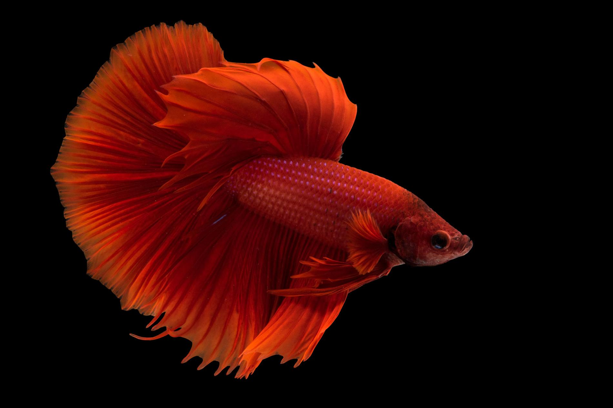
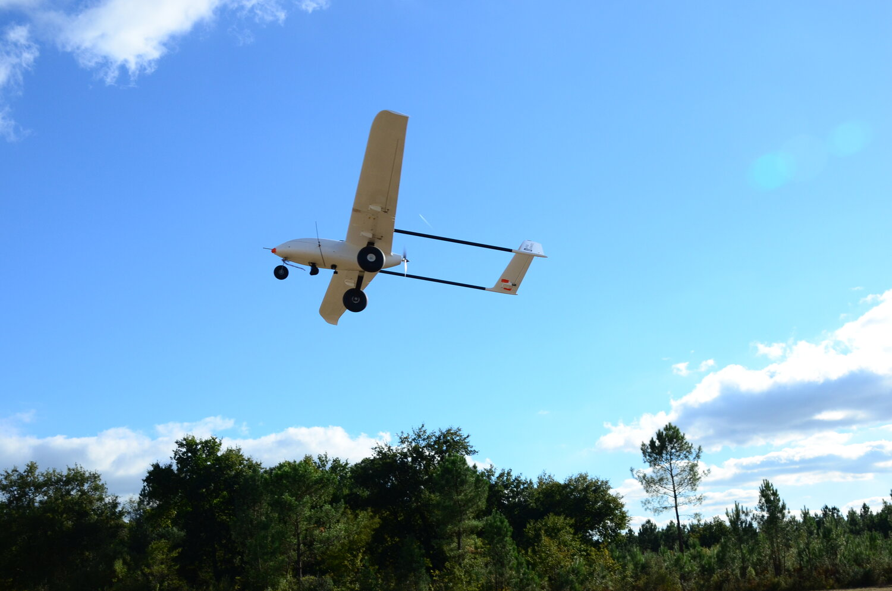
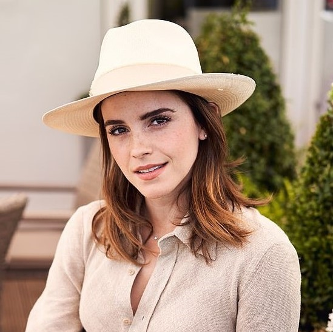
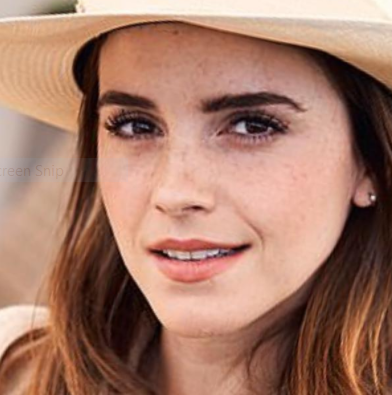
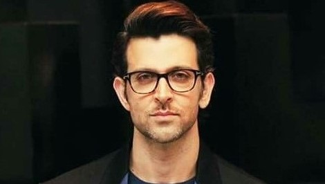
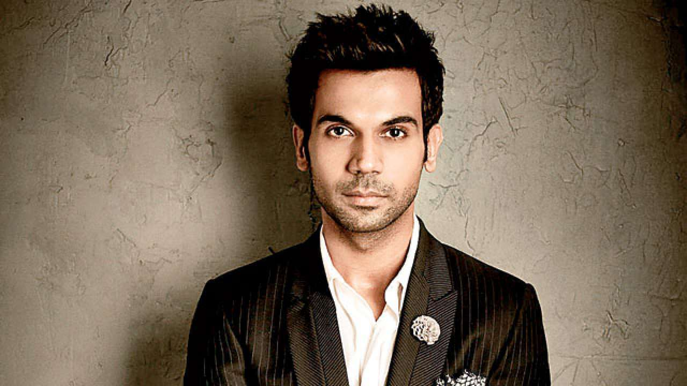

# Session 3 -Face Recognition Part 1

[](http://orionai.s3-website.ap-south-1.amazonaws.com/)
[](https://github.com/shan18/EVA4-Phase-2/tree/master/03%20-%20Face%20Recognition%20Part%201)

The goal of this assignment is to create and deploy the following models on AWS Lambda and create a static website on AWS S3 for the users to interact with the trained models:

- ResNet-34 model pre-trained on the imagenet dataset
- Custom MobileNetV2 model trained in the [last](https://github.com/shan18/EVA4-Phase-2/tree/master/02%20-%20MobileNet) assignment to classify objects belonging to a custom dataset containing following classes
  - Flying Bird
  - Large Quadcopter
  - Small Quadcopter
  - Winged Drones
- Face Alignment
- Face Swap

All the files and the models have to be deployed to AWS Lambda. The code to deploy them can be found [here](deployment/).

## Resnet34

Pre-trained ResNet-34 trained on the ImageNet dataset. The model can be downloaded as follows

```[python]
import torch
from torchvision.models import resnet

model = resnet.resnet34(pretrained=True)
model.eval()

traced_model = torch.jit.trace(model, torch.rand(1, 3, 224, 224))
traced_model.save('resnet34.pt')
```

### Result

|                            Input Image                             |           Prediction           |
| :----------------------------------------------------------------: | :----------------------------: |
|  | goldfinch, Carduelis carduelis |

## MobileNetV2

MobileNetV2 trained on a custom dataset using transfer learning. The complete step-by-step explaination to deploy and train this model can be found [here](https://github.com/shan18/EVA4-Phase-2/tree/master/02%20-%20MobileNet).

### Result

|                             Input Image                             |  Prediction  |
| :-----------------------------------------------------------------: | :----------: |
|  | Winged Drone |

## Face Alignment

This model uses [dlib's](http://dlib.net/) `shape_predictor_5_face_landmarks.dat` landmark detection model to align the face of an input image. The dlib model can be downloaded and extracted with the following commads

```[bash]
$ wget http://dlib.net/files/shape_predictor_5_face_landmarks.dat.bz2
$ bzip2 -dk shape_predictor_5_face_landmarks.dat.bz2
```

To execute the model, run the script  
`python3 face_alignment.py -p <predictor_path> -i <image_path>`

### Result

|                            Input Image                             |                                Output Image                                 |
| :----------------------------------------------------------------: | :-------------------------------------------------------------------------: |
|  |  |

## Face Swap

[](https://colab.research.google.com/drive/1PLVfPFcEhzOPygiBP-jNFsXpNC6FNKyz?usp=sharing)

This model uses [dlib's](http://dlib.net/) `shape_predictor_68_face_landmarks.dat` landmark detection model to swap the face in the _target input image_ with the face in the _source input image_. The dlib model can be downloaded and extracted with the following commands

```[bash]
$ wget http://dlib.net/files/shape_predictor_68_face_landmarks.dat.bz2
$ bzip2 -dk shape_predictor_68_face_landmarks.dat.bz2
```

Facial landmarks of the images are detected to create a mask, where the face of the other image will be placed. Initially we perform a **Simple Alpha Blending** and then later **Seamless Cloning** is done to get the final swapped image.

### Result

|                        Source Input Image                         |                        Target Input Image                         |                              Output Image                              |
| :---------------------------------------------------------------: | :---------------------------------------------------------------: | :--------------------------------------------------------------------: |
|  |  |  |
