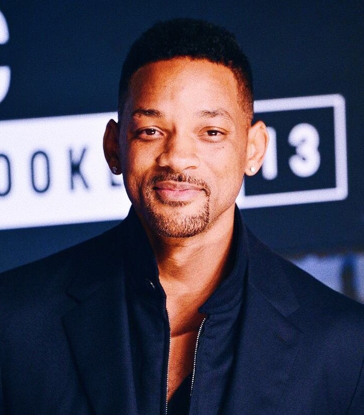

# Session 4 - Face Recognition Part II

[](http://orionai.s3-website.ap-south-1.amazonaws.com/recognize)

The goal of this assignment is to create an interactive website where one can perform face recognition. We have used following classes to train our model:

- Donald Trump
- Elon Musk
- Emma Stone
- Emma Watson
- Geoffrey Hinton
- Hrithik Roshan
- Narendra Modi
- Priyanka Chopra
- Tom Cruise
- Will Smith

All the files and the models have to be deployed to AWS Lambda. The code to deploy them can be found [here](deployment/).

### Parameters and Hyperparameters

- Training Accuracy: 99.90%
- Loss: 0.00062
- Loss Function: Cross Entropy Loss
- Epochs: 15
- Optimizer: SGD
- Learning Rate: 0.01
- Batch Size: 32
- Scheduler: StepLR

## Results

|                             Input Image                             | Prediction |
| :-----------------------------------------------------------------: | :--------: |
|  | Will Smith |

## Dataset Preparation

[](https://colab.research.google.com/drive/1H7unbfc8gC9gFkpKczOlqnsUmCF60tGG?usp=sharing)

The dataset was aligned using dlib library. The code to do face alignment using `dlib` can be found [here](../03%20-%20Face%20Recognition%20Part%201/face_alignment.py).
After alingment each image was set to a resolution of 600x600.

## Training

[](https://colab.research.google.com/drive/1HBeQakPLH5SDOu02t0j4w6VCB0UoHO42?usp=sharing)

The images in the dataset was resized to a resolution of **224x224** and the transformation of **RandomHorizontalFlip** was applied, before training.

Since the number of images in each class was not equal, it led to **class Imbalance problem**. To solve this problem, a widely adopted technique is called **resampling** was implemented. It consists of less samples from the majority class and/or adding more examples from the minority class.

```
train_loader = torch.utils.data.DataLoader(dataset_train, batch_size, sampler=sampler)
```

The InceptionResnetV1 model was used for this classification which was pretrained on **vggface2**. The code for the model can be found [here](https://github.com/timesler/facenet-pytorch/blob/master/models/inception_resnet_v1.py).

While training the model, we freezed the initial layers and fine-tuned last five layers of the model. To freeze the initial layers:

```
param.requires_grad = False
```
