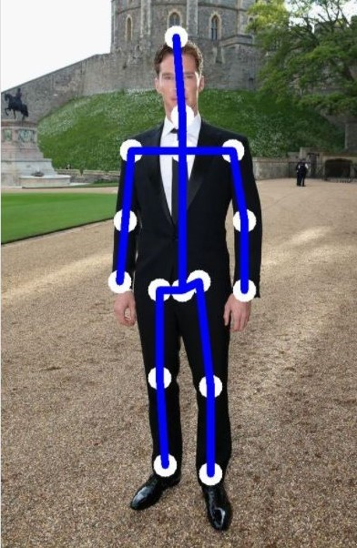
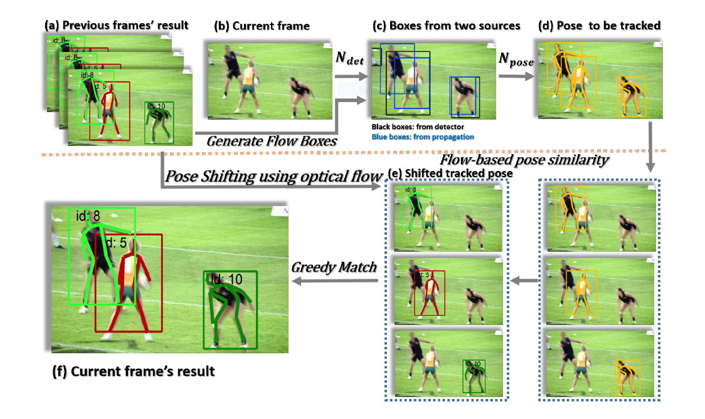
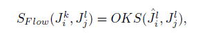
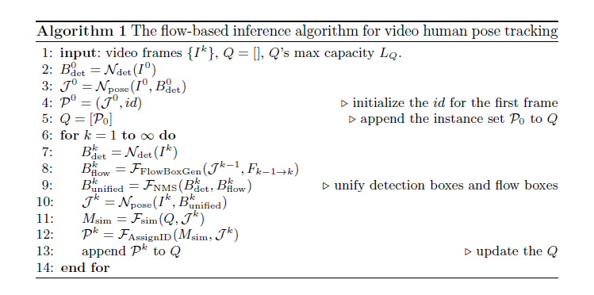

# Session 5 - Monocular Human Pose Estimation and ONNX Models

[](http://orionai.s3-website.ap-south-1.amazonaws.com/pose)

This assignment had two objectives:

- Deploy a pre-trained model to predict the Monocular Human Pose in an image.
- Read [this paper](https://arxiv.org/pdf/1804.06208.pdf) and write a summary of the model architecture and the loss function used.

## Code Setup

To run the pose estimation script follow the steps below:

- Install requirements  
  `pip install -r requirements.txt`
- Download the pre-trained pose estimation model (`pose_resnet_50_256x256.pth.tar`) from [here](https://drive.google.com/drive/folders/1g_6Hv33FG6rYRVLXx1SZaaHj871THrRW) and move it to the _models_ directory.
- Run the pose estimation script  
  `python3 pose_estimation.py --image <path to image>`

To convert the model to **ONNX**, use the `--convert` flag, it will save the model in the onnx format.  
`python3 pose_estimation.py --image <path to image> --convert`

### Results

The model deployed on AWS Lambda gave the following results

|                             Input Image                             |                             Output Image                             |
| :-----------------------------------------------------------------: | :------------------------------------------------------------------: |
|  |  |

<br />

# Paper: Simple Baselines for Human Pose Estimation and Tracking

[](https://arxiv.org/pdf/1804.06208.pdf)

Pose Tracking is the task of estimating multi-person human poses in videos and assigning unique instance IDs for each keypoint across frames. Accurate estimation of human keypoint-trajectories is useful for human action recognition, human interaction understanding, motion capture and animation.

Human Pose Estimation is a challenging task and it has come a long way from 80% PCKH@0.5 to more than 90%. The leading methods for solving this problem on MPII benchmark have considerable difference in many details but minor difference in accuracy which makes it difficult to tell which details are crucial. The above paper devises a simple paradigm to solve the problem statement. It provides baseline methods for both pose estimation and tracking. They are quite simple but surprisingly effective.

## Pose Estimation Using A Deconvolution Head Network

ResNet architecture with three deconvolutional layers over the last convolution stage in the ResNet, called C5, was used for pose estimation. This structure was espoused because it is the simplest to generate heatmaps from deep and low resolution features.

- The deconvolutional layers with batch normalization and
  ReLU activationare used.
- Each layer has 256 lters with 4X4 kernel.
- The stride is 2.
- A 1X1 convolutional layer is added at last to generate predicted
  heatmaps for all k key points.

<p align='center'>
     
</p>
Comparing the two state-of-the-art network architectures (CPN and Hourglass) with this architecture(1.c) it is found that  three upsampling steps and three levels of non-linearityare used to obtain high-resolution feature maps and heatmaps.   
But model(1.c) combines the upsampling and convolutional parameters into deconvolutional layers in a much simpler way, without using skip layer connections.

## Pose Tracking Based on Optical Flow

<p align='center'>
    
</p>

The idea behind the Multi-person pose tracking is to assign a unique identication number (id) to a estimated human poses in a frame, and then tracks these human pose
across other frames.

I<sup>k</sup> : k<sup>th</sup> Frame  
P : Human instance P = (J, id),
where J = {j<sub>i</sub>}<sub>1:N<sub>j</sub></sub> is the coordinates set of N<sub>j</sub> body joints and id indicates the
tracking id.

When processing the I<sup>k</sup> frame, we have the already processed
human instances set P<sup>k-1</sup> = {P<sub>i</sub><sup>k-1</sup>}<sub>1:N<sub>k-1</sub></sub>
in frame I<sup>k-1</sup> and the instances set
P<sup>k</sup> = {P<sub>i</sub><sup>k</sup>}<sub>1:N<sub>k</sub></sub> in frame I<sup>k</sup> whose id is to be assigned, where N<sub>k-1</sub> and N<sub>k</sub> are
the instance number in frame I<sup>k-1</sup> and I<sup>k</sup>. If one instance P<sup>k</sup><sub>j</sub> in current frame I<sup>k</sup> is linked to the instance P<sub>i</sub><sup>k-1</sup> in I<sup>k-1</sup> frame, then id<sup>k-1</sup><sub>i</sub> is propagated to id<sup>k</sup><sub>j</sub>, otherwise a new id is assigned to P<sup>k</sup><sub>j</sub> , indicating a new track.

In simple words, if the one human pose detected in the current frame matches with a already detected human pose in the previous frame, then the tracking id alloted is passed to the human pose detected in the current frame, and if not the new tracking id is assigned to it.

To achieve this the authors incorporated the following which makes their model different from the other state-of-the-art networks.

## Architecture

### Joint Propagation using Optical Flow

They found that applying a detector meant for a image to video can lead to missing and predicting false detections as a frame from a video can be blur or can have occlusions. For this they proposed to generate boxes for the processing frame from nearby frames using temporal information expressed in optical flow.

They proposed that joints coordinates of one human instance in a frame can be estimated from the previous frame. More specically, for each joint location (x, y) in J<sub>i</sub><sup>k-1</sup>, the propagated joint location would be (x + *x; y + *y),
where *x; *y are the flow field values at joint location (x, y).

Using this a new bounding box is computed for the human pose in the crrent frame.That box is expanded to some extend (15% in experiments) and is used as the candidate box for pose estimation.

\*x = delta(x)

### Flow-based Pose Similarity

Finding pose similarity is a grave challenge in this use case.

1. IoU(Intersection-over-Union) can't be used as the similarity metric as it will be difficult when an instance moves fast thus the
   boxes do not overlap, and in crowed scenes where boxes may not have the corresponding relationship with instances.
1. The pose similarity could also be problematic when the pose of the same person is different across frames due to pose changing.

They proposed a metric which calculates the body joints distance between two human instances using **Object Keypoint Similarity (OKS)** which is a flow-based pose similarity metric.

<p align='center'>
    
</p>

where OKS represents calculating the Object Keypoint Similarity (OKS) between two human pose, and J<sub>i</sub><sup>l</sup> represents the propagated joints for J<sub>i</sub><sup>k</sup> from
frame I<sup>k</sup> to I<sup>l</sup> using optical flow.

### Flow-based Pose Tracking Algorithm

<p align='center'>
    
</p>

This algorithm combines the above two **Flow-based Pose Similarity** and **Flow-based Pose Similarity**.

- Estimation: The input frame is processed to produce bounding boxes from
  - human detector
  - joint propogation from the previous frames using optimal flow

They are combined using Non-Maximum Suppression (NMS) operation. These boxes are then cropped and resized to estimate human pose using proposed pose estimation network(1.c).

- Tracking

The instances are tracked in a double-ended queue with fixed length L<sub>Q</sub>, denoted as

Q = [P<sub>k-1</sub>,P<sub>k-1</sub>, ..., P<sub>k- L<sub>Q</sub></sub>]

where P<sub>k-i</sub> means tracked instances set in previous frame I<sub>k-i</sub> and the Q's length L<sub>Q</sub> indicates how many previous frames considered when performing matching.

1. For the I<sub>k</sub> frame, flow-based pose similarity matrix M<sub>sim</sub> between the current untracked instances set of body joints J<sub>k</sub> (id is none) and previous instances sets in Q is calculated.
1. An id is assigned to each body joints instance J in J<sub>k</sub> to a human pose to get the instance set P<sub>k</sub> by using greedy matching and Msim.
1. Finally Q is update by adding k<sup>th</sup> frame instance P<sup>k</sup>.

## JointsMSELoss

**JointsMSELoss** is calculated by mean of MSELoss between the predicted heatmaps and targeted heatmaps for each joint/body-point </br>

```python
# Intuition: JointMSELoss
import torch.nn.functional.mse_loss as MSELoss

for idx in range(num_joints):  # for each joint
    heatmap_pred = heatmaps_pred[idx]  #predicted heatmaps
    heatmap_gt = heatmaps_gt[idx]  #target heatmaps
    loss = MSELoss(heatmap_pred, heatmap_gt)) #MSELoss b/w predicted & targeted heatmap of a joint
    loss += 0.5 * loss  #sum loss value for all joints

JointMSELoss = loss / num_joints # average loss over all joints loss
```

The targeted heatmap for each joint is generated by applying a 2D gaussian centered on joint’s ground truth location

**target_weight** can be used to give different weightage to different joints while calculating final JointsMSELoss </br> </br>

**Original JointsMSELoss code:**

```python
import torch.nn as nn

class JointsMSELoss(nn.Module):
    def __init__(self, use_target_weight):
        super(JointsMSELoss, self).__init__()
        self.criterion = nn.MSELoss(size_average=True)
        self.use_target_weight = use_target_weight

    def forward(self, output, target, target_weight):  #e.g. output.shape= torch.Size([8, 16, 64, 64])
        batch_size = output.size(0) # 8
        num_joints = output.size(1) # 16
        heatmaps_pred = output.reshape((batch_size, num_joints, -1)).split(1, 1)# return 16 tuples of torch.Size([8, 1, 4096])
        heatmaps_gt = target.reshape((batch_size, num_joints, -1)).split(1, 1)
        loss = 0

        # Calculate MSELoss b/w pred & gt for each joint
        for idx in range(num_joints):
            heatmap_pred = heatmaps_pred[idx].squeeze()  # torch.Size([8, 4096])
            heatmap_gt = heatmaps_gt[idx].squeeze()
            if self.use_target_weight:
                loss += 0.5 * self.criterion(
                    heatmap_pred.mul(target_weight[:, idx]),
                    heatmap_gt.mul(target_weight[:, idx])
                )
            else:
                loss += 0.5 * self.criterion(heatmap_pred, heatmap_gt) # sum loss

        return loss / num_joints  # Average loss
```
