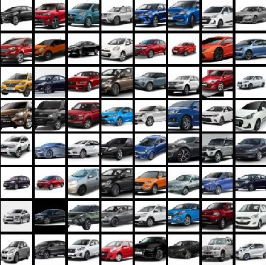
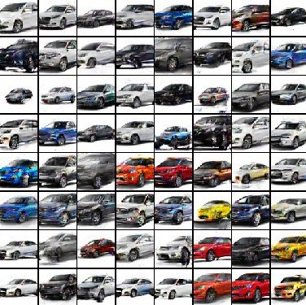
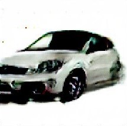
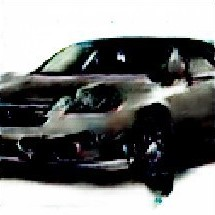
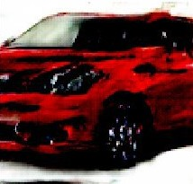
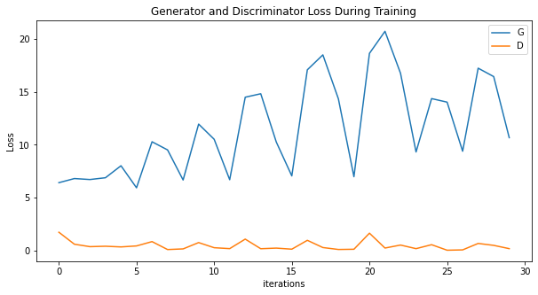

# Session 6 - Generative Adversarial Networks

The goal of this assignment is to create an interactive website that generates Indian cars.

All the files and the models have to be deployed to AWS Lambda. The code to deploy them can be found [here](deployment/).

### Parameters and Hyperparameters

- Loss Function: Binary Cross Entropy Loss
- Epochs: 1000
- Optimizer: Adam
- Learning Rate: 0.0002
- Batch Size: 128

## Results

|                               Real cars                               |                          Generated Fake Cars                          |
| :-------------------------------------------------------------------: | :-------------------------------------------------------------------: |
|  |  |

## Some of the Generated Fake Cars

|                                                                    |                                                                    |
| :----------------------------------------------------------------: | :----------------------------------------------------------------: |
|  |  |
|  |  |
|                                                                    |

## Generator and Discriminator Loss During Training

    

## Dataset Preparation

For the dataset, we downloaded **Indian car** images from various sources such as Flicker and Google Images. The images of the car are facing the left side.

- Image Size: 64x64x3
- Number of Images: 1124
