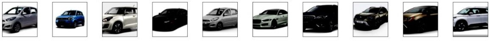
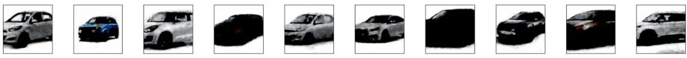
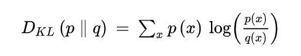

# Session 7 - Variational AutoEncoders

The goal of this assignment is to create an interactive website that uses Variational Auto Encoder to reconstruct an input image of a car.

All the files and the models have to be deployed to AWS Lambda. The code to deploy them can be found [here](deployment).

### Parameters and Hyperparameters

- Loss Function: Mean Squared Loss + Kullback–Leibler Divergence Loss
- Epochs: 2500
- Optimizer: Adam
- Learning Rate: 0.001 for first 2000 epochs then 0.0001 for next 500 epochs.
- Batch Size: 32
- Image size: 128

## Results

### Input

    

### Output

    

## Dataset Preparation

For the dataset, we downloaded **Indian car** images from various sources such as Flicker and Google Images. The images of the car are facing the left side.

- Image Size: 64x64x3
- Number of Images: 1124

## Variational Auto Encoder

A variational autoencoder (VAE) provides a probabilistic manner for describing an observation in latent space. Thus, rather than building an encoder which outputs a single value to describe each latent state attribute, it formulates the encoder to describe a probability distribution for each latent attribute.

    

Intuitively, the mean vector controls where the encoding of an input should be centered around, while the standard deviation controls the “area”, how much from the mean the encoding can vary. As encodings are generated at random from anywhere inside the “circle” (the distribution), the decoder learns that not only is a single point in latent space referring to a sample of that class, but all nearby points refer to the same as well. This allows the decoder to not just decode single, specific encodings in the latent space (leaving the decodable latent space discontinuous), but ones that slightly vary too, as the decoder is exposed to a range of variations of the encoding of the same input during training.

    

The model is now exposed to a certain degree of local variation by varying the encoding of one sample, resulting in smooth latent spaces on a local scale, that is, for similar samples.

## Kullback-Leibler Divergence Loss

KLD Loss is a method to compare two probability distributions. For the discrete probability distribution p & q, the KL Divergence between them is defined as

    

