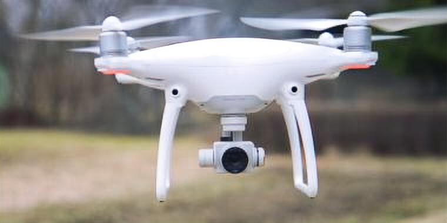
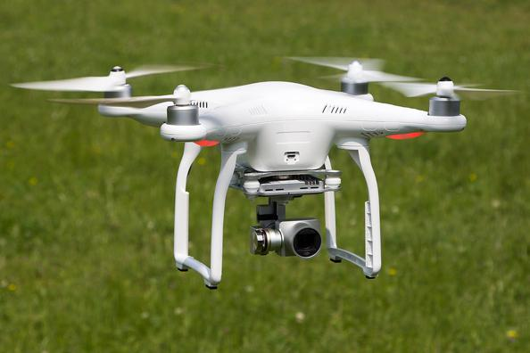
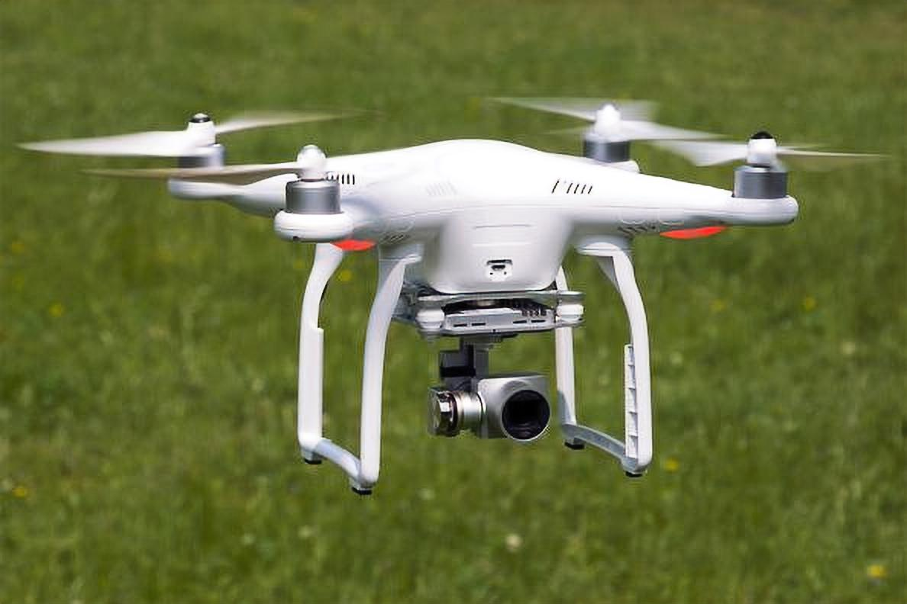
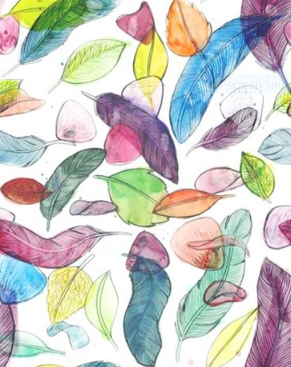
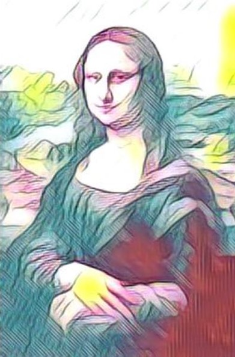
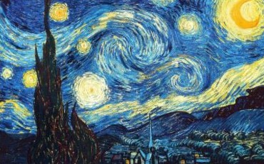
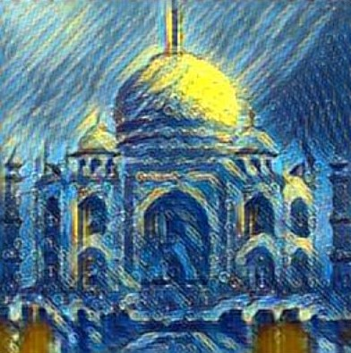

# Session 8 - Image Super-Resolution and Neural Style Transfer

## Image Super-Resolution

[](http://orionai.s3-website.ap-south-1.amazonaws.com/srgan)
[](https://colab.research.google.com/drive/1ojIQHa6e7L-hbnynV_cmhQdSAPD1fTQO?usp=sharing)

The goal of this assignment is to create an interactive website that increase the resolution of a low resolution image.

All the files and the models have to be deployed to AWS Lambda. The code to deploy them can be found [here](deployment/srgan).

### Parameters and Hyperparameters

- Loss Function: Combination of Adversarial, Perception, TV and Mean Square Error loss
- Epochs: 124
- Optimizer: Adam
- Batch Size: 64
- Upscale Factor: 2

### Dataset Preparation

[](https://drive.google.com/file/d/1DrWfankalnC1nn3cl-yG5kjfMgVJbIv5/view?usp=sharing)
[](https://colab.research.google.com/drive/1siJ8ghbotStRnHAodbOujnwsVsq_qdGi?usp=sharing)

Number of Images: 15084

The dataset was cleaned using the above colab file. Following changes were applied:

- Corrupted and non-image files were removed
- PNG and grayscale images were converted to RGB JPG format
- Rename .jpeg files to .jpg
- Remove images with resolution less than 150 \* 150.

## Results

|                              Input Image                               |                              Output Image                               |
| :--------------------------------------------------------------------: | :---------------------------------------------------------------------: |
|  |  |
|  |  |

## To Train

- Clone the [SRGAN](https://github.com/leftthomas/SRGAN) repository.
- Replace `model.py`, `train.py` and `data_utils.py` files from this repository with files the [srgan](srgan) folder.

```
python train.py --crop_size <crop_size> --upscale_factor <upscale_factor> --num_epochs <number_of_epochs>
```

## Neural Style Transfer

[](http://orionai.s3-website.ap-south-1.amazonaws.com/style)

Neural style transfer is an artificial system based on a Deep Neural Network that creates artistic images of high perceptual quality. The system uses neural representations to separate and recombine content and style of arbitrary images, providing a neural algorithm for the creation of artistic images.

All the files and the models have to be deployed to AWS Lambda. The code to deploy them can be found [here](deployment/style_transfer).

The model is referenced from the [MSG-Net repository](https://github.com/StacyYang/MSG-Net).

### Results

|                                     Input Image                                     |                              Style Image                               |                                     Output Image                                     |
| :---------------------------------------------------------------------------------: | :--------------------------------------------------------------------: | :----------------------------------------------------------------------------------: |
|                 |    |                |
|  |  |  |
