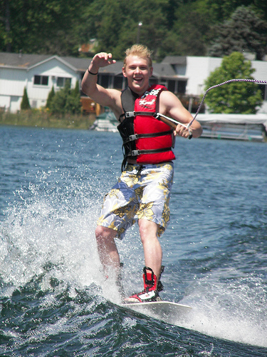
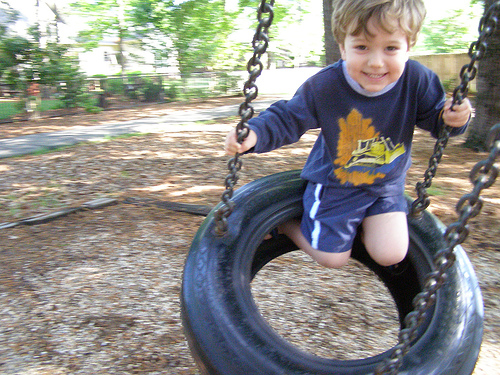
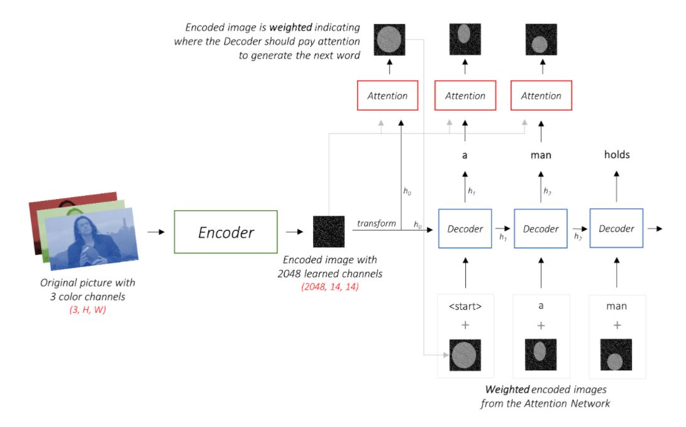

# Session 12 - Image Captioning

The goal of this assignment is to train and deploy an image caption generation model. The code for deployment can be found [here](deployment).

### Parameters and Hyperparameters

- Loss Function: NLLLoss
- Bleu Score: 14.0
- Epochs: 120
- Encoder: Pre-trained ResNet-18 on ImageNet dataset
- Decoder Learning Rate: 4e-4
- Optimizer: Adam
- Batch Size: 32
- Embedding dimension: 128
- Attention dimension: 128
- Decoder dimension: 128
- Dropout: 0.5

## Results

|                             Input Image                              |                    Output Caption                    |
| :------------------------------------------------------------------: | :--------------------------------------------------: |
|  |     a man in a wetsuit is surfing on a surfboard     |
|  |      a group of people sit on a snowy mountain       |
|  | a young boy in a red shirt is riding on a tire swing |

## Architecture

We used an Encoder-Decoder architecture. The encoder is 18-layered Residual Network pre-trained on the ImageNet classification task and the layers are not fine tuned. Decoder has attention incorporated into it as it will help to look at different parts of the image to generate prediction for the sequence.

      

## Attention Mechanism

A neural network is considered to be an effort to mimic human brain actions in a simplified manner. Attention Mechanism is also an attempt to implement the same action of selectively concentrating on a few relevant things, while ignoring others in deep neural networks.

An attention mechanism allows the model to focus on the currently most relevant part of the source sentence. In this project we implemented additive attention that was used in Bahdanau et al.

      

The code present here has been referenced from [this](https://github.com/sgrvinod/a-PyTorch-Tutorial-to-Image-Captioning) repository.
