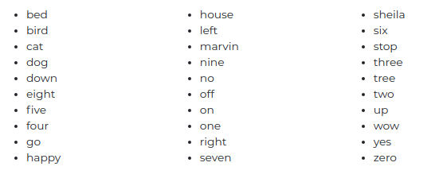

# Session 13 - AI for Sound

The goal of this assignment is to train and deploy a simple asr model that can transcribe one-word utterances. Only the utterances of the following 30 words are supported by the model

  

Since the audio uttrances need to be in WAV format, the complete deployment took two lambdas.

- In first lambda, we deployed ffmpeg which can convert any audio to WAV.
- The output of the ffmpeg lambda was then sent to our pytorch lambda for prediction.

## Dataset

We use [Google's Speech Dataset](https://ai.googleblog.com/2017/08/launching-speech-commands-dataset.html) to train the model. The dataset consists of 65,000 one-second long utterances of 30 short words, by thousands of different people.

## Results

The model achieves an accuracy of **92%** on the test dataset. To test the model, go to the [deployment link](https://orionai.github.io/EVA4-OrionAI/speechtotext).
